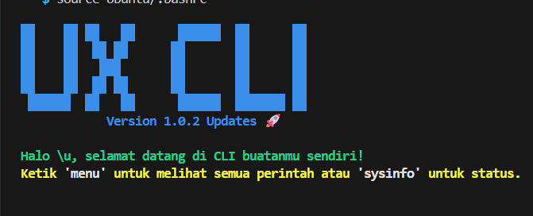

# ⚡ Power FULL CLI - Bash Configuration


Konfigurasi bash kustom yang dirancang untuk meningkatkan produktivitas developer dengan workflow yang cepat, estetik, dan fungsional.


---

### 📷 Dokumentasi Visual
<!-- Masukkan link gambar dokumentasi Anda di sini -->


---

### 🛠️ Cara Instalasi

1. Salin seluruh isi folder `Ubuntu/` ke direktori HOME Anda.
2. Tambahkan baris berikut di akhir file `~/.bashrc` Anda:
   ```bash
   source ~/Ubuntu/.bashrc
   ```
3. Refresh terminal:
   ```bash
   source ~/.bashrc
   ```

---

### ✨ Fitur Utama

| Fitur | Perintah | Deskripsi |
| :--- | :--- | :--- |
| **Pusat Bantuan** | `menu` | Menampilkan semua daftar perintah yang tersedia (ala Artisan). |
| **Statistik Sistem** | `sysinfo` | Menampilkan ringkasan RAM, OS, IP, dan Uptime secara rapi. |
| **Scaffolding** | `go-project` | Membuat project (Nuxt, Next, Angular, Laravel) secara interaktif. |
| **Ekstraksi Cepat** | `extract <file>` | Satu perintah untuk mengekstrak semua format file (`.zip`, `.rar`, dll). |
| **Navigasi Cepat** | `..`, `...`, `-` | Berpindah folder lebih cepat dari perintah standar `cd`. |
| **Manajemen Node** | `nvm` | Dukungan bawaan untuk mengelola berbagai versi Node.js. |
| **Pencarian File** | `f <nama>` | Mencari file secara instan di direktori aktif saat ini. |
| **Info Jaringan** | `myip`, `speedtest` | Cek IP publik dan kecepatan internet langsung dari terminal. |

---

### 📂 Struktur Folder

- `Ubuntu/.bashrc` : Inti dari konfigurasi shell dan alias.
- `Ubuntu/go-project.sh` : Modul interaktif untuk instalasi framework.

---
*Dibuat untuk Developer Indonesia yang mengedepankan efisiensi.*